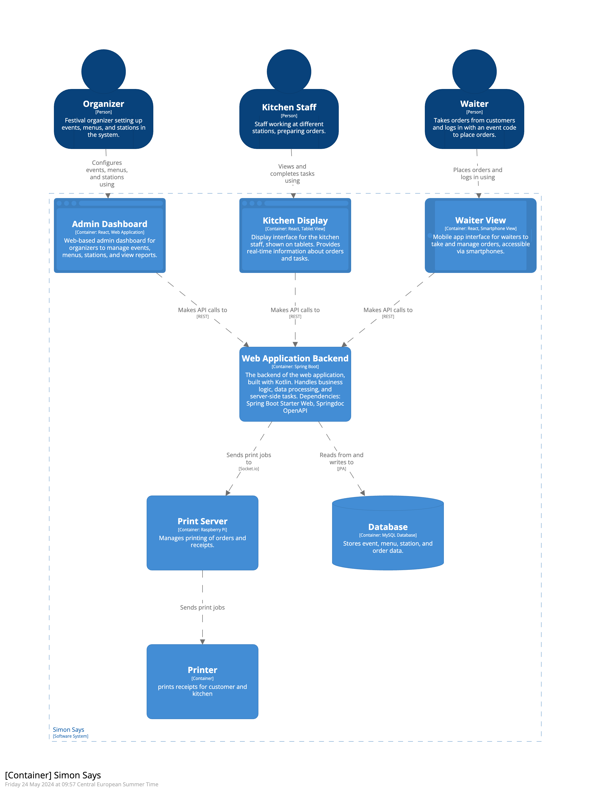

# Simon Says
This is the main repository for the Simon Says project - conducted by the PM4 group at the Zurich University of Applied Sciences (ZHAW).

## Overview

Simon Says is a software system designed to enhance the production cycle within the gastronomy sector, especially
tailored for festivals for CEVI Effretikon. The system simplifies managing events, menus, and orders, enabling efficient
operation through a collection of applications tailored for organizers, kitchen staff, and waiters.

Container Diagram:


### Components

- **Frontend**: All user interfaces are built with React and presented as web applications.
  - **Admin Dashboard**: A web-based dashboard for event and menu management.
  - **Kitchen Display**: A tablet interface for kitchen staff to view and manage orders in real time.
  - **Waiter View**: A mobile application for waiters to take and manage orders.
- **Web Application Backend**: Handles business logic and data processing, built with Kotlin and Spring Boot.
- **Database**: Utilizes MySQL to store essential data.
- **Print Server**: Manages the printing of orders and receipts using a Raspberry Pi.

## Getting Started

To run the system locally, follow the instructions below. For detailed information on how to run a specific component,
use the linked README files.

### Prerequisites

- Java 17 or newer for the backend.
- Node.js and npm for running the frontend applications.
- Docker for the database.
- Raspberry Pi for the print server.

### Installation

1. **Clone the repository**
   ```bash
   git clone https://github.com/SimonSays-PM4/simon-says.git
   ```

----

2. **Set up the backend (Database Container, Spring Boot)**
   ```bash
   cd backend
   docker-compose up -d
   ./gradlew bootRun --args='--spring.profiles.active=dev'
   ``` 
   For further information, see the [backend README](backend/README.md).

---

3. **Set up the frontend (React)**
   ```bash
   cd frontend
   npm install
   npm run api 
   npm run build
   npm start  
   ```
   For further information, see the [frontend README](frontend/README.md).

----

4. **Configure the print server**
   Instructions for setting up the Raspberry Pi and configuring it to work with the system.\
   Details about running the print server: [printer-server README](printer/README.md).

## Usage

The local development environment can be accessed at the following URLs:

- **Admin Dashboard**: http://localhost:3000
- **Kitchen Display**: http://localhost:3000/kitchen (tbd)
- **Waiter View**: http://localhost:3000/waiter (tbd)
- **Backend Swagger UI**: http://localhost:8080/swagger-ui/index.html

Staging environment can be accessed at the following URLs:
- https://simonsays-stage.pm4.init-lab.ch/

## Contributing

This is an opensource project and we welcome contributions.

## Documentation

You can find the end-user guide [here](https://simonsays-pm4.github.io/simon-says/).\
If you want to update the documentation, please read more in the [documentation README](documentation/retype/README.md).

## License

tbd -> KAN-12 ?

