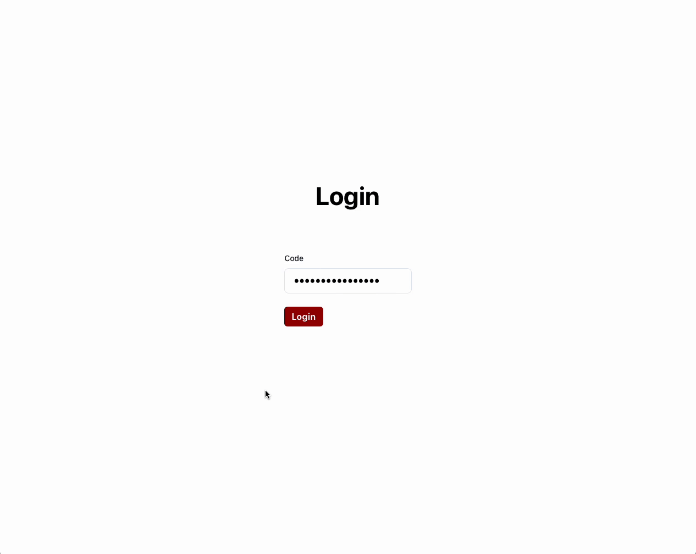
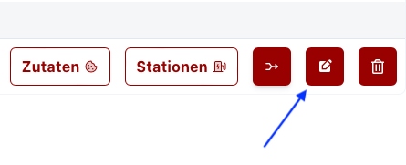

# Beispiel

Um einen Event zu erstellen, logge dich im Admin Dashboard ein und klicke auf den Button "Erstellen". Beim Erfassen des Events gibst du den Namen, ein Passwort und die Anzahl Tische ein.

## Event Passwort
Um Bestellungen zu erfassen oder eine Station anzuzeigen, benötigst du das Event Passwort. Dieses Passwort wird beim Erstellen des Events festgelegt und kann bei Bedarf auch später geändert werden.
Wähle ein sicheres Passwort, damit nur berechtigte Personen Zugriff auf die Bestellungen haben.

Sobald dein Event erstellt ist, kannst du Menüs und Produkte hinzufügen. In den nachfolgenden Seiten findest du Anleitungen, wie du Menüs und Produkte erstellst.

Den Event kannst du jederzeit bearbeiten oder löschen. Hier können die Anzahl Tische oder das Passwort geändert werden.

