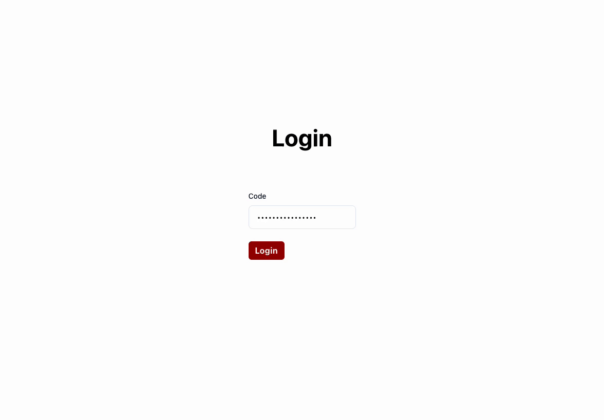

# Beispiel

Um ein Event zu erstellen, logge dich in das Admin Dashboard ein und klicke auf die Schaltfläche "Erstellen". Wenn du den Event erstellst, gibst du einen Namen, ein Passwort und die Anzahl der Tische ein.

## Event Passwort
Um Bestellungen aufzugeben oder eine Station anzusehen, benötigst du das Event Passwort. Dieses Passwort wird beim Erstellen des Events festgelegt und kann später bei Bedarf geändert werden.
Wähle ein sicheres Passwort, damit nur berechtigte Personen auf die Bestellungen zugreifen können.

Sobald dein Event erstellt ist, kannst du Menüs und Produkte hinzufügen. Auf den folgenden Seiten findest du eine Anleitung zum Erstellen von Menüs und Produkten.

Du kannst das Event jederzeit bearbeiten oder löschen. Hier kannst du die Anzahl der Tische oder das Passwort ändern.
