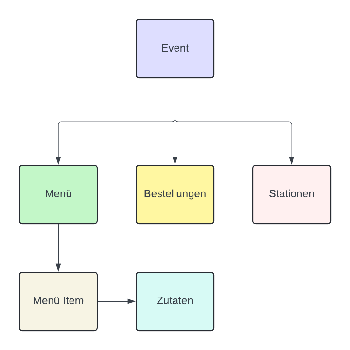

# Vorbereitung

Vor deinem Event erstellst du im Admin Dashboard von Simon Says deinen Anlass und die dazugehörigen Produkte. 
In den nachfolgenden Seiten, findest du sämtliche Anleitungen, um einfach und schnell deinen Anlass zu erstellen.

Im Bild siehst du den Aufbau des Admin-Dashboards. Wenn du dich anmeldest, erstellst du zuerst einen neuen Event.
Der Event ist die übergeordnete Kategorie, in der du Menüs und Produkte erstellst. 
* Ein Menü besteht aus mehreren Produkten. Beispielsweise besteht ein Menü aus einem Getränk und einem Snack. 
* Ein Produkt ist ein einzelnes Element, wie ein Getränk oder ein Snack und kann einem Menü zugeordnet werden.
* Eine Zutat ist ein Bestandteil eines Produktes. Beispielsweise besteht ein Burger aus einem Patty, einem Bun und weiteren Zutaten.

Sobald du die benötigten Produkte erstellt hast, kannst du die Bestellungen aufnehmen und die Bestellungen abarbeiten.
Die erfassten Bestellungen werden dann bei den Stationen angezeigt, welche du ebenfalls im Admin Dashboard erstellen kannst.
