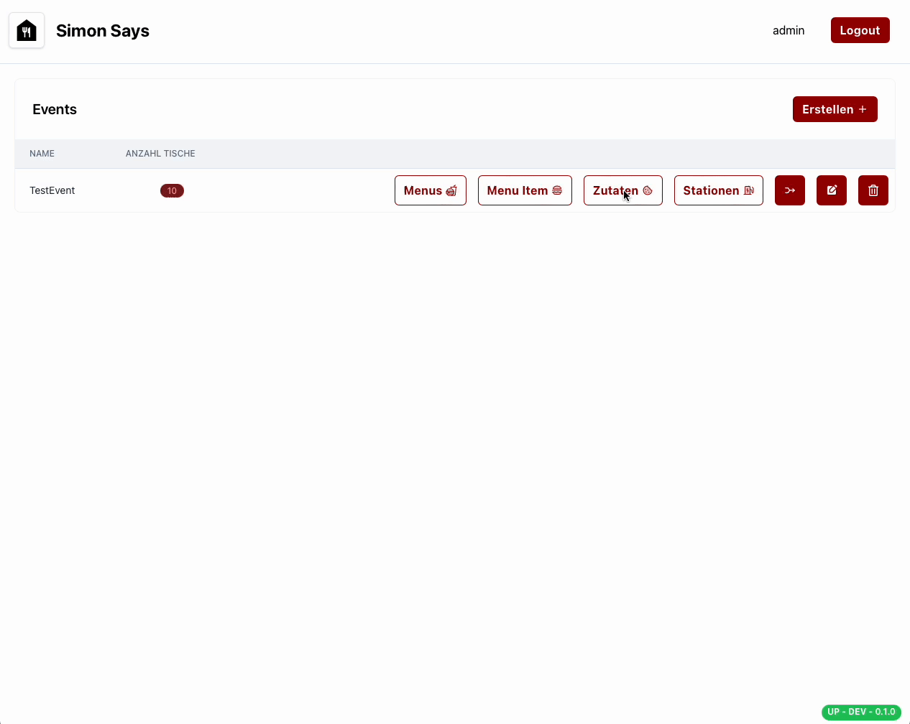

# Beispiel

Als erstes musst du die Zutaten erfassen, die du für deine Produkte benötigst. Bei den Zutaten kannst du unterscheiden, ob eine Zutat produziert werden muss oder nicht.
Zum Beispiel muss ein Burger Patty produziert werden, während ein Burger Bun nicht produziert werden muss. Das ist wichtig, damit die Zutaten später an den Stationen richtig angezeigt werden.

Hier würdest du auch Getränke erfassen. 