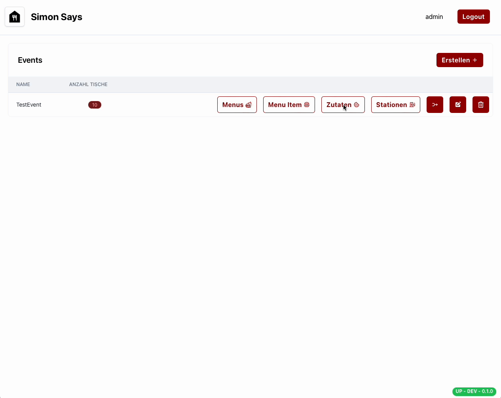

# Beispiel

Als Erstes musst du die Zutaten erfassen, die du für deine Produkte benötigst. Bei den Zutaten kannst du unterscheiden, ob eine Zutat produziert werden muss oder nicht.
Ein Burger-Patty muss beispielsweise produziert werden, während ein Burger Bun nicht produziert werden muss. Dies ist wichtig, damit später bei den Stations die Zutaten korrekt angezeigt werden.

Hier würdest du auch Getränke erfassen. 