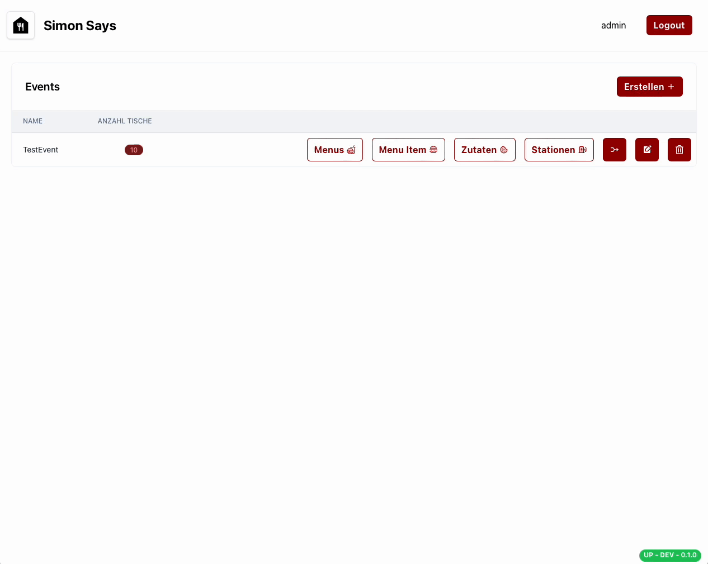

# Beispiel

Ein Menü setzt sich aus mehreren Produkten zusammen. Ein Produkt kann z.B. ein Burger, ein Getränk oder ein Dessert sein. Das Dropdown-Menü zeigt alle bereits angelegten Menüeinträge an.

