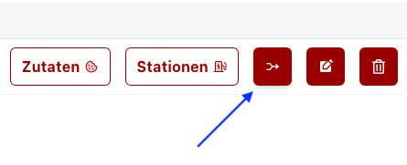
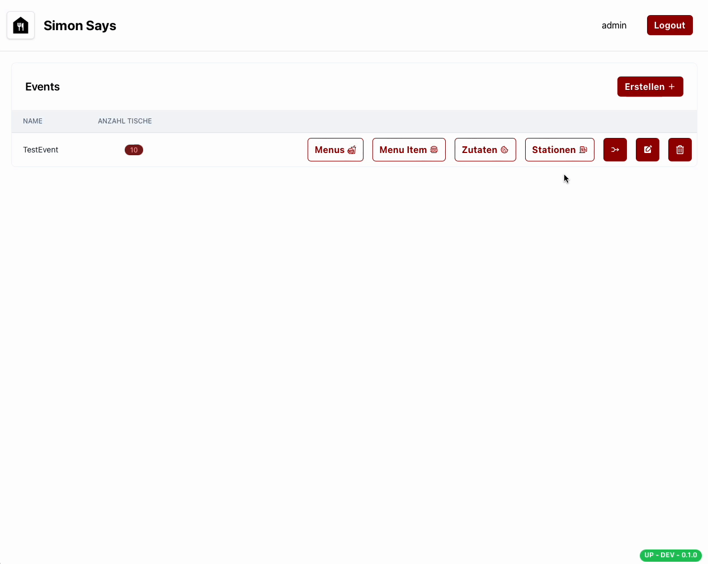
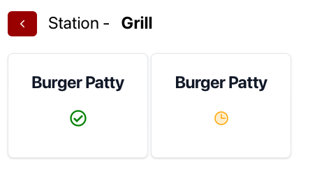
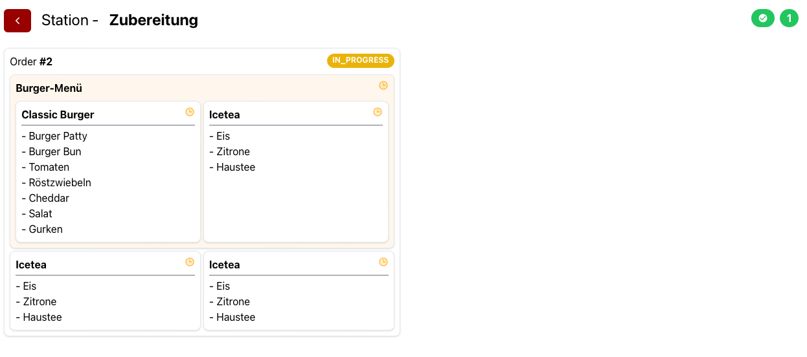
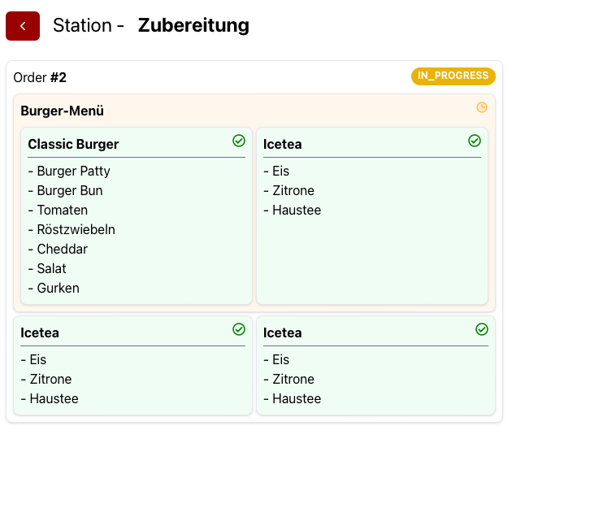

# Stationen

Eine Station ist ein Ort, an dem Zutaten produziert oder fertige Bestellungen zusammengestellt werden. Beispielsweise kann eine Station einen Grill, eine Bar oder eine Ausgabe sein.
Die Ansicht der Station kann auf einem Tablett aufgerufen werden, um die Bestellungen zu sehen und abzuarbeiten. Um Bestellungen abzuarbeiten, müssen die Zutaten bzw. die Menu Items doppelt angeklickt werden.

## Arten von Stations

1. **Produktionsstation**: An dieser Station werden Zutaten produziert. Beispielsweise kann an dieser Station ein Burger-Patty gebraten werden.
2. **Ausgabestation**: An dieser Station werden die Bestellungen zusammengestellt und ausgegeben. Beispielsweise kann an dieser Station ein Burger zusammengestellt und ausgegeben werden.

In der Aufnahmen siehst du, wie du eine Station erstellst und die Zutaten zuweist.

Sobald die Stations erfasst sind, können Bestellungen aufgenommen und abgearbeitet werden. Die Bestellungen werden dann bei den entsprechenden Stationen angezeigt.

## Event beitreten
Um die Station-Ansicht zu öffnen, klicke auf das "Join-Event"-Symbol in der Event-Übersicht.

Melde dich mit deinem Namen und dem im Voraus festgelegten Event-Passwort an. Der Name wird in der Station-Ansicht angezeigt, um die Bestellungen zuordnen zu können.

Sobald du dich eingeloggt hast, siehst du zuerst die Bestellungen. Daneben siehst du die erstellten Stationen.

## Produktionsstation
Wenn Bestellungen erfasst werden, sind diese danach in den Stationen sichtbar. Hier zu sehen ist die Grill-Station, an der ein Burger-Patty gebraten wird. Das Patty wird als erledigt markiert, sobald es einmal angeklickt wird.

## Ausgabe-Station
In der Ausgabe-Station werden die Bestellungen angezeigt, sobald die Zutaten produziert wurden. Die Bestellungen können dann zusammengestellt und ausgegeben werden.

Oben rechts wird die Anzahl der bereits bearbeiteten Bestellungen angezeigt.
Auch in dieser Ansicht werden abgeschlossene Bestellungen als erledigt markiert, sobald sie angeklickt werden. Nachdem auch das Menü in diesem Beispiel abgearbeitet wurde, ist die Bestellung erledigt und wird nicht mehr angezeigt.

