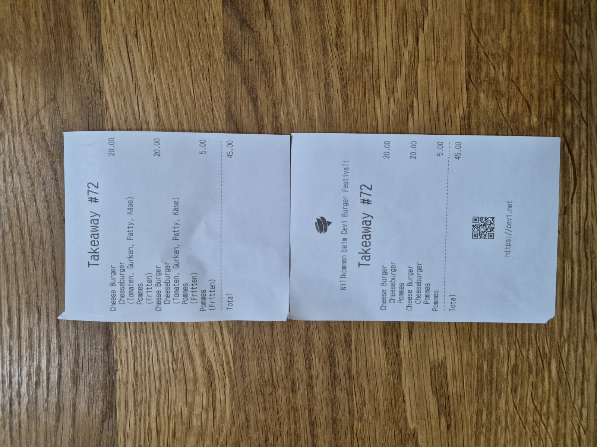
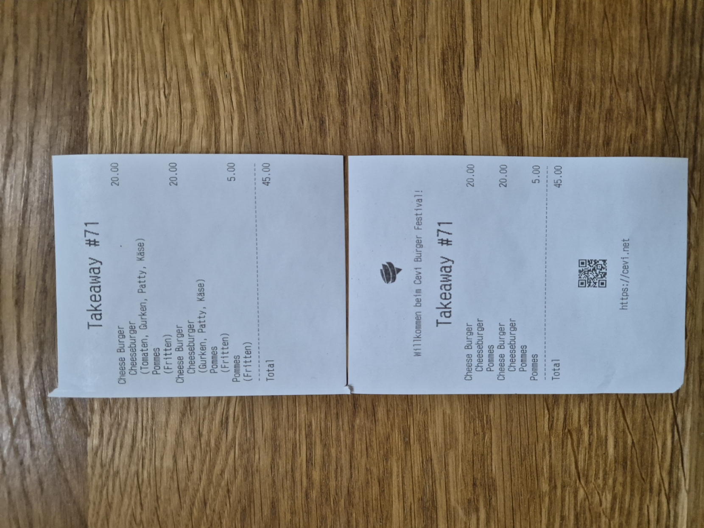
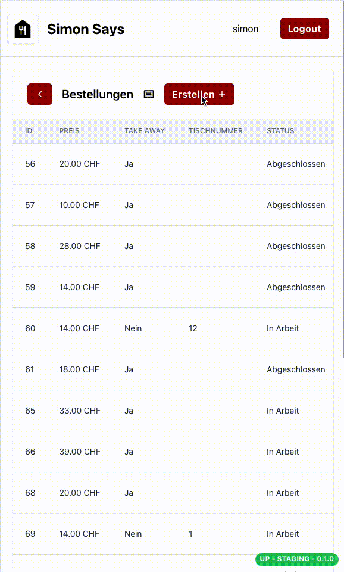
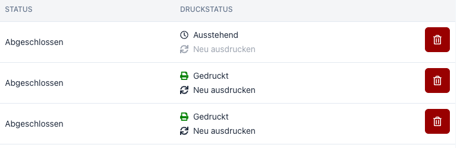
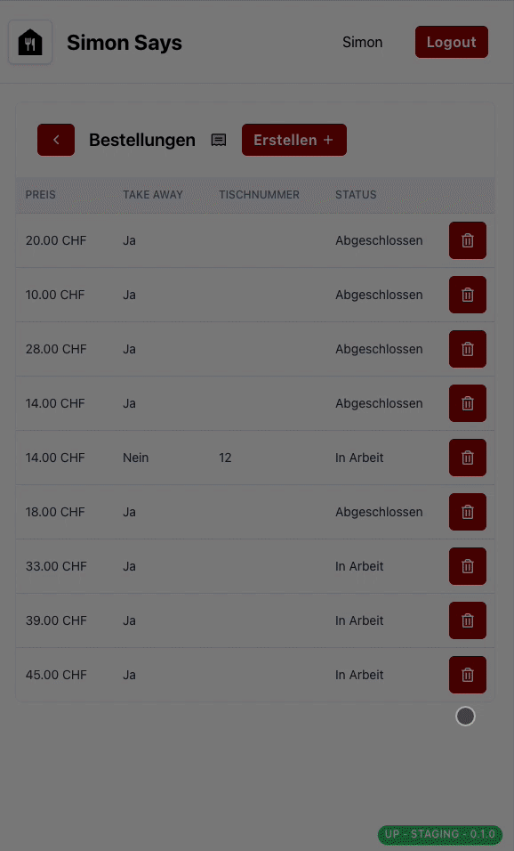

# Bestellungen
Damit Bestellungen aufgegeben werden können, muss zuerst ein Event erstellt und Produkte und Menüs hinzugefügt werden. 
Nachdem das Event erstellt wurde, können Bestellungen aufgegeben werden. Dazu benötigst du das Event-Passwort, das beim Erstellen des Events festgelegt wurde.

## Bestellung aufgeben
Um eine Bestellung aufzugeben, gehe auf die Seite "Bestellungen" und klicke auf die Schaltfläche "Erstellen". Danach erscheint das Bestellformular, in dem du die gewünschten Produkte auswählen kannst.

Zuerst musst du auswählen, ob es sich hier um eine Takeaway-Bestellung handelt. Sollte dies nicht der Fall sein, kannst du hier die Tischnummer eintragen.
Wird eine Takeaway-Bestellung aufgegeben, wird auf der Quittung die Takeaway-Nummer angezeigt.

Anschliessend kannst du die gewünschten Menüs und Menu Items auswählen.
Du kannst die selektieren Menus / Menu Items auch wieder entfernen, oder die Bestellung individuell anpassen (z.B. Tomaten entfernen).
Solche Anpassungen werden auf der Quittung vermerkt.

### Druckerstatus prüfen und Quittung neu drucken
Auf der Übersichtsseite aller Bestellungen siehst du den Druckerstatus der jeweiligen Bestellung. Dau kannst eine Quittung neu drucken, indem du auf "Neu ausdrucken" klickst.

## Bestellung löschen
Um eine Bestellung zu löschen, gehe auf die Seite "Bestellungen" und klicke auf die Schaltfläche "Löschen". Bestätige die Löschung, indem du auf "Löschen" klickst.
Das Modifizieren einer Bestellung ist nicht möglich. Du musst die Bestellung löschen und eine neue Bestellung aufgeben.
