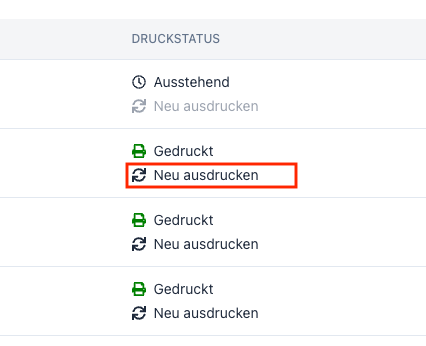

# Fehlerbehebung
Um mögliche Fehler zu vermeiden, empfehlen wir dir, genügend Zeit für die Vorbereitung einzuplanen. Besonders bei der Erstellung von Events, Menüs und Stationen ist es wichtig, dass du alle Informationen korrekt eingibst. Deine Infrastruktur sollte ebenfalls getestet werden, um sicherzustellen, dass alle Geräte korrekt funktionieren. 
Sollte es dennoch zu Problemen kommen, findest du hier einige Lösungsvorschläge.

## Druckaufträge neu starten
Falls ein Drucker nicht korrekt funktioniert, kann es helfen, die Druckaufträge zu neu starten. Im Admin-Dashboard findest du unter den Bestellungen die Möglichkeit, die Print-Jobs zu löschen und neu zu starten.\

## Geräte neu starten
Falls ein Gerät nicht korrekt funktioniert, kann es helfen, das Gerät neu zu starten.\
- **Router und Drucker**: Ziehe den Stecker des Routers aus der Steckdose und warte einige Sekunden. Stecke den Stecker danach wieder ein und warte, bis das Gerät wieder hochgefahren ist.
- **Tablet**: Halte den Power-Button gedrückt, bis das Gerät heruntergefahren ist. Starte das Gerät danach wieder neu.

## Reserve-Drucker verwenden
Falls ein Drucker nicht korrekt funktioniert, kannst du einen Reserve-Drucker verwenden. Am besten konfigurierst du bereits im Voraus einen Reserve-Drucker, um im Notfall schnell reagieren zu können. Diesem Drucker kannst du die gleichen Einstellungen wie dem Hauptdrucker zuweisen.

